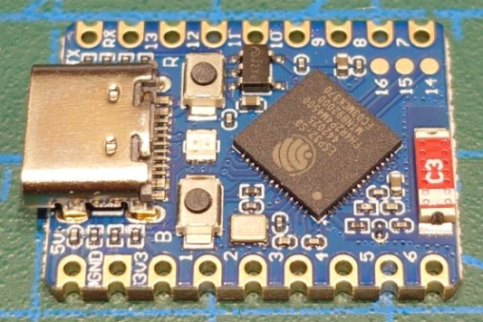
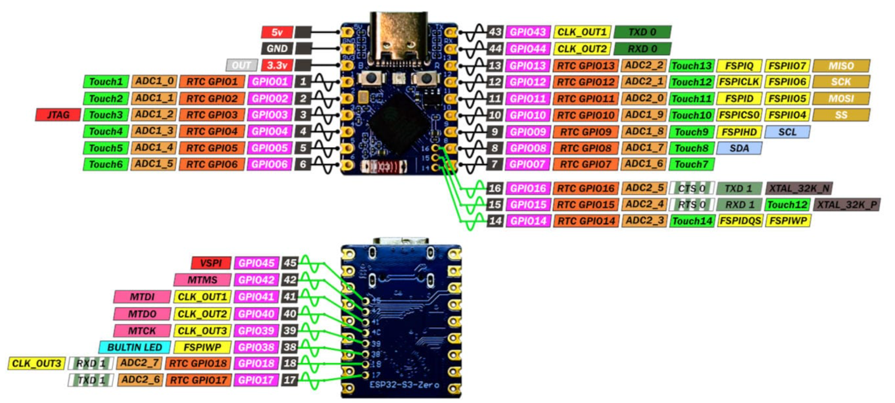
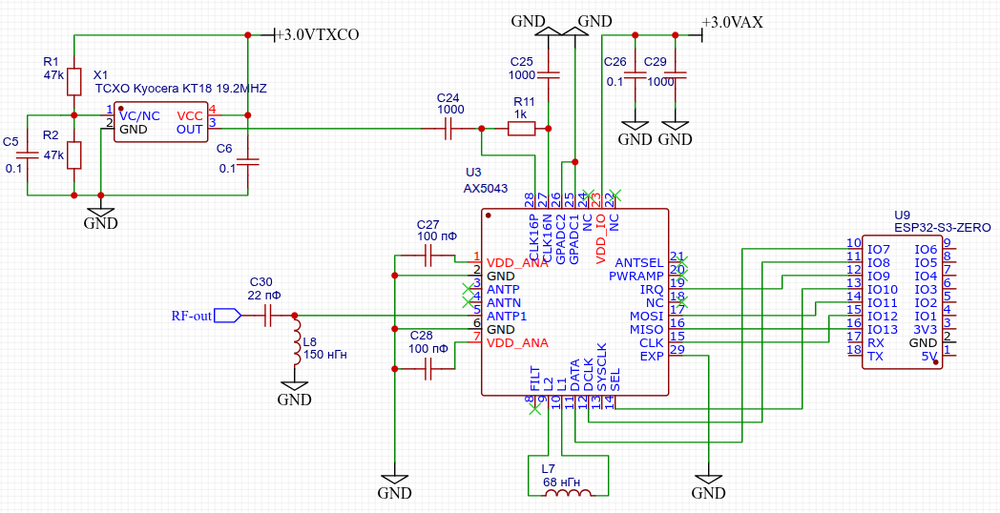
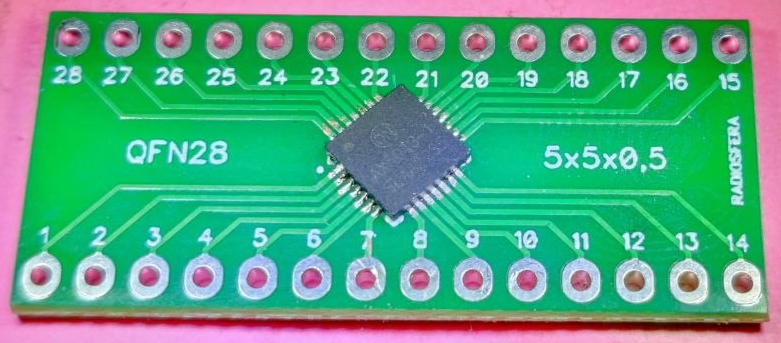
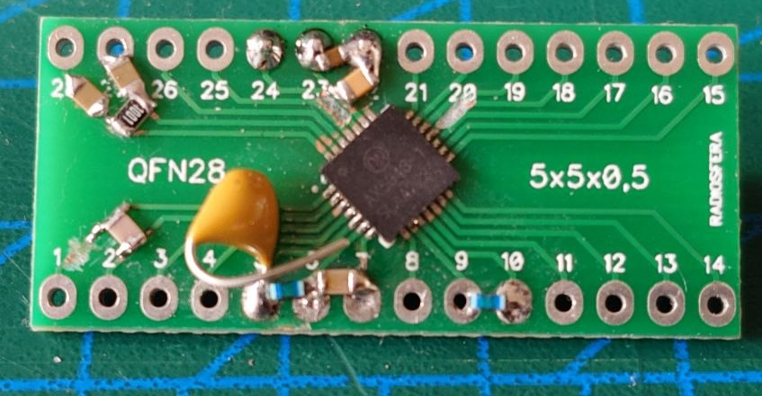
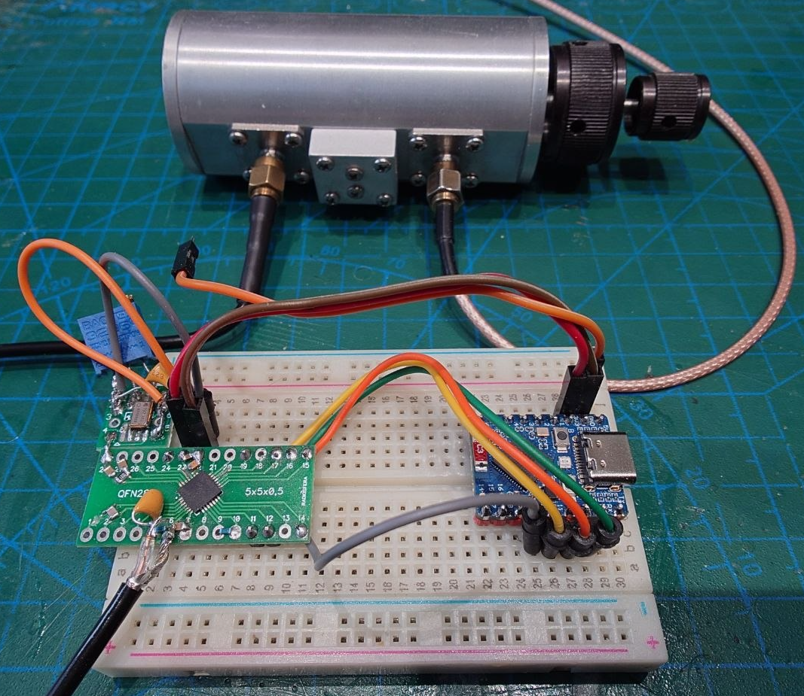
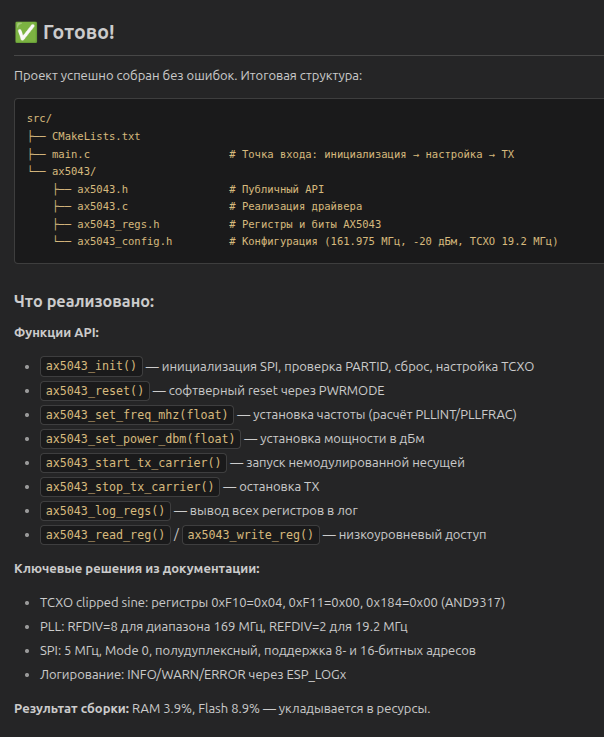

# AIS приемник на базе AX5043
## Задачи
1. Научиться работать с радиочипом AX5043 при помощи ИИ-инструментов: агенты, MCP, генерация кода, рефакторинг, отладка и тп
2. Разработать и протестировать схему ВЧ части AX5043 для приема AIS сигнала
3. Разработать ПО для работы в связке ESP32 и AX5043
4. Провести тестирование AIS приемника, измерить его чувствительность, энергопотребление

## Железо
1. Плата [ESP32-S3-Zero](https://cnx-software.ru/2024/08/07/waveshare-esp32-s3-zero-eto-miniatyurnyj-modul-wifi-i-ble-iot-s-portom-usb-c-do-32-gpio/)
2. Радиочип AX5043 с самодельной обвязкой: TXCO, LDO, ВЧ-часть и тп
   

## Софт
1. Операционная система Ubuntu Ubuntu 24.04.3 LTS
2. Visual Studio Code v1.108.2
3. Ассистент (агент) [Continue](https://marketplace.visualstudio.com/items?itemName=Continue.continue) в виде плагина для VS Code
4. Агент [Qwen Code](https://qwen.ai/qwencode) и плагин [Qwen Code Companion](https://marketplace.visualstudio.com/items?itemName=qwenlm.qwen-code-vscode-ide-companion) для интеграции с Visual Studio Code. С 2026.04.15 бесплатный доступ к LLM закрыт
5. Локальные MCP сервера: [Platformio MCP](https://github.com/jl-codes/platformio-mcp), [Serial monitor MCP](https://github.com/Adancurusul/serial-mcp-server), [GitHub MCP](https://github.com/github/github-mcp-server), [MCP PDF](https://github.com/rsp2k/mcp-pdf) быстрый PDF парсер с ~50 инструментами, [Document Parser MCP](https://github.com/agenson-tools/document-parser-mcp) от agenson, [Docling MCP](https://github.com/docling-project/docling-mcp) (использует [Docling](https://www.docling.ai/)), интегрированные с Continue/VS Code
6. Различные браузерные LLM: ChatGPT, Deepseek, Qwen, Prism, Perplexity и другие
7. Агрегаторы LLM: [https://build.nvidia.com](https://build.nvidia.com), [Open Router](https://openrouter.ai/models?q=free) 

## Вводная
После многочисленных попыток "завести" плату [E32 170T30D для приема AIS сигнала](https://github.com/wla-da/ais_170t30d) (получилось, но недостаточная чувствительность на уровне порядка -85 дБм в пакетном режиме) решил попробовать другие варианты. 

Чип [AX5043](docs/AX5043-datascheet.PDF) по описанию подходит замечательно: умеет работать с кастомной преамбулой, может производить дифференциальное кодирование/декодирование (считай, тоже NRZI), умеет искать именно HDLC пакеты и проверять нужную CRC-16-CCITT/X-25. А еще может [выдавать IQ сигнал](https://www.notblackmagic.com/bitsnpieces/ax5043/), может работать на [частотах до 27 МГц](docs/AX5043%20How%20to%20operate%20AX5043%20at%2027%20MHz.pdf), может [выдавать и передавать аналоговый сигнал](docs/AX5043%20Use%20as%20Analog%20FM.pdf) (FM-трансмиттер) и тп. 

Есть [референсная схема](docs/AX5043-169MHz-GEVK%20SCHEMATIC.PDF) на 169 МГц, [конфигурация](docs/AX5043%200dBm%208mA%20TX%20and%209.5mA%20RX%20Configuration%20for%20the%20868MHz.pdf) на 868 МГц, [мануал по программированию](docs/AX5043%20Programming%20AND9347-D.PDF) AX5043. 

Есть реальные работающие схемы УКВ-трансиверов на [AX5043](docs/AX5043-datascheet.PDF) от [richardeoin](https://github.com/richardeoin/ax/blob/master/hw/pi/ax-gateway.sch.pdf), от [PQ9ISH](https://gitlab.com/librespacefoundation/pq9ish/pq9ish-comms-vu-hw/-/blob/master/Radio.kicad_sch?ref_type=heads) (KiCAD файл, для быстрого просмотра kiCAD схем можно использовать online viewer [Altium](https://www.altium.com/viewer/)) и двухдиапазонного трансивера от [NotBlackMagic](https://www.notblackmagic.com/projects/vuhf-radio/files/VUHF_Radio_Schematic_R3.pdf).

К сожалению, данный чип снят с производства и больше не поддерживается производителем. Например, мне так и не получилось найти и скачать фирменную утилиту AX RadioLab для настройки регистров чипа. Не получилось найти в продаже с доставкой в РФ готовые платы на AX5043, например, [E31-230T27D](https://www.amazon.sa/-/en/E31-230T27D-AX5043-230MHz-Wireless-Transceiver/dp/B09K677D4M) от E-byte (похоже, снят с производства).

## Сборка железа

Рис 1. Плата ESP32-S3-Zero 

Рис 2. Назначение выводов ESP32-S3-Zero 

Рис 3. Схема подключения AX5043 и ESP32-S3-Zero (простейший генератор для проверки)

Рис 4, 5, 6. Фото этапов сборки макетной платы с AX5043 и ESP32-S3-Zero (LDO для TXCO и AX5043 не распаяны)

Для тестирования работы используется режим генератора несущей на частоте 161,975 МГц с уровнем -10 дБм с выводом ВЧ-сигнала с пина ANTP1 (5) с простейшей LC-цепочкой без фильтрации и согласования, пины ANTP (3) и ANTN (4) не задействованы.

Таблица 1. Подключение шины SPI
| AX5043    | ESP32-S3-Zero |
| --------- | ------------  |
| MOSI (17) | GPIO11 (14)   |
| MISO (16) | GPIO13 (16)   |
| CLK (15)  | GPIO12 (15)   |
| SEL (17)  | GPIO10 (13)   | 
 

Для распайки AX5043 были заказаны на российском маркетплейсе платы-переходники QFN-28 на DIP, TXCO распаян временно на отдельной плате для удобства. Подключена шина SPI, IRQ, DATA, DATA_CLK. Первое включение, проверка сигнала на выходе SYSCLK (13) AX5043 - обнаружен стабильный меандр с частотой  1,200 МГц, т.е. AX5043 потенциально рабочая (по умолчанию включен делитель fXTAL/16, частота TXCO 19,200 Мгц), хотя была куплена по невысокой цене на российском маркетплейсе.

## Программная часть тестового генератора

Нужно было опробовать новый радиочип, разобраться с его режимами и регистрами. Решил сделать простой генератор несущей на 161,975 МГц. Конечно, писать полностью код для десятков регистров не очень удобно, поэтому воспользовался помощью ИИ агента.
Примерно через полчаса работы агента (MCP сервера уже были установлены) я получил красивый компилируемый без ошибок код и сообщение:

Рис 7. Агент радостно рапортует об успешном завершении работы.

Конечно же, это была преждевременная радость и отладка кода (с переписыванием с нуля уже с помощью других LLM) заняла еще пару не полных дней. Посещали мысли - "а точно ли радиочип настоящий, а не фейковая копия?". Но в конце концов, всё получилось увидеть на спектроанализаторе заветный пик на нужной частоте.

## Сравнение моделей (очень субъективно) 

Таблица 2. Субъективное сравние моделй
| Модель | Провайдер | Использование  | Скорость | Точность | Комментарий |
| ------ | --------- | -------------- | -------- | -------- | ----------- |
| z-ai/glm5 | Nvidia | Continue/Agent | Средняя | Хорошая | Пишет по делу, галлюцинаций сравнительно немного, вполне качественный код. Бывает падает с ошибкой "400 Unterminated string starting at: line 1 column 12 (char 11)" |
| moonshotai/kimi-k2-instruct-0905 | Nvidia | Continue/Agent | Средняя/Высокая | Хорошая | Достаточно шустрая модель, сравнительно немного глюков, Бывает падает с ошибкой "400 Unterminated string starting at: line 1 column 2 (char 1)" |
| [qwen/qwen3-coder-480b-a35b-instruct](https://build.nvidia.com/qwen/qwen3-coder-480b-a35b-instruct) | Nvidia | Continue/Agent | Средняя/Высокая | Хорошая | Неплохое качество кода, даже может бороться с ошибкой вида "400 Unterminated string starting at: ..." через промет  |

## TODO железо
1. Управлять входами EN для TXCO и радиочипа с MCU для снижения энергопотребления
2. Управлять входом Vcon TXCO (корректировка частоты) с MCU через RC-фильтр для компенсации старения и тп

## Полезные ссылки
1. Кросс-платформенный [драйвер AX5043](https://gitlab.com/librespacefoundation/ax5043-driver/) и [УКВ-приемник](https://gitlab.com/librespacefoundation/pq9ish/pq9ish-comms-vu-sw) с использованием данного драйвера
2. Двухдиапазонный [УКВ-трансивер на базе AX5043](https://github.com/NotBlackMagic/VUHFRadio) с собственным уникальным драйвером и детальным описанием [AX5043 от NotBlackMagic](https://www.notblackmagic.com/bitsnpieces/ax5043/), включая получение IQ сигнала, аналоговую де/модуляцию ЧМ и тп
3. Еще один УКВ трансивер и [драйвер AX5043](https://github.com/richardeoin/ax/), заточен под Linux + Python и [Raspberry Pi](https://github.com/richardeoin/ax/tree/master/hw/pi)
4. Подборка [материалов по AX5043](https://www.bdtic.com/en/on/AX5043) (битые ссылки?)
