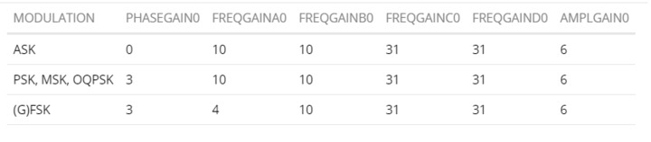

# Регистры AX5043


Регистров у AX5043 без малого три сотни, описывать все практического смысла нет. Для детального изучения обязательно использовать [даташит](docs/AX5043-datascheet.PDF) и [руководство по программированию](docs/AX5043%20Programming%20AND9347-D.PDF). 

Из дополнительного:
* Использование разных видов [TCXO](docs/AX5043%20Use%20with%20a%20TCXO.pdf) 
* [Обнаруженные ошибки](docs/AX5043-ERROR-DATA.PDF) в части переключения режимов Tx/Rx и использования BT=0.3 для GMSK 
* Описание работы с чипом от [NotBlackMagic](https://www.notblackmagic.com/bitsnpieces/ax5043/)

Здесь будут описаны наиболее важные регистры для приема AIS сигнала.


## Адресация регистров AX5043
1. Однобайтовая адресация регистров (короткая форма)
   
Адреса от 0x000 до 0x06F зарезервированы для «динамических регистров», то есть регистров, которые будут часто использоваться в обычном режиме работы, поскольку к ним можно эффективно обращаться с помощью однобайтового SPI-доступа.  Адреса от 0x070 до 0x0FF остались неиспользованными (обращение к ним - через двухбайтовую SPI адресацию регистра).

**Короткая форма**: байт команды = `[R/W:1 бит][ADDR:7 бит]`.  
Чтение: бит 7=0, Запись: бит 7=1. Адреса 0x00–0x6F.

2. Двухбайтовая адресация регистров (длинная форма)

Адреса от 0x100 до 0x1FF зарезервированы для регистров параметров физического уровня, например, приемника, передатчика, ФАПЧ, кварцевого генератора. 

Адреса от 0x200 до 0x2FF зарезервированы для параметров доступа к среде передачи, таких как кадрирование (framing), обработка пакетов. 

Адреса от 0x300 до 0x3FF зарезервированы для специальных функций, например, GPADC.

**Длинная форма**: при последовательной записи в регистры с адресами ≥0x070 адрес регистра **автоинкрементируется** после каждого байта.


## Размер регистров
1. Однобайтовые, обычные регистры
2. Двухбайтовые, пример IRQMASK1 (0x006) и IRQMASK0 (0x007)
3. Трехбайтовые, пример TRKDATARATE2 (0x045), пример TRKDATARATE1 (0x046), пример TRKDATARATE0 (0x047)
4. Четырехбайтовые, пример FREQA3 (0x034), FREQA2 (0x035), FREQA1 (0x036), FREQA0 (0x037)
5. Специальный регистр FIFODATA (0x029) размером 256 байт, имеет сложную структуру, поддерживает метаданные, чанки и специальные команды.  FIFO использует **чанк-формат**: каждый блок данных начинается с заголовка (`0xE1` = данные, `0xE2` = статус). Быстрая очистка данных и флагов FIFO через запись команды 0x03 в FIFOSTAT (0x028). См детали "FIFO OPERATION" стр 7 [руководства по программированию](docs/AX5043%20Programming%20AND9347-D.PDF). 

Чтение/запись в регистры, включая многобайтовые, производится атомарно старшим байтом сначала (MSB). 

Большинство регистров можно менять «на лету». Но параметры, влияющие на **ФАПЧ, модуляцию и скорость передачи**, следует изменять только в режиме **POWERDOWN**


## Пайплайн обработки сигнала

!Схема пайплайна обработки сигнала восстановлена на основе документации на чип и может содержать неточности. Приводится для понимания картины в целом, взаимосвязи отдельных этапов обработки сигнала и регистров чипа.

```
┌─────────────────────────────────────────────────────────────────┐
│ ВХОД ОТ АНТЕННЫ (RF)                                            │
│ (несущая 161.975 МГц, GMSK 9600 бод)                            │
└─────────────────────────────────────────────────────────────────┘
│
▼
┌─────────────────────────────────────────────────────────────────┐
│ БЛОК 1: ВЧ АВТОПОДСТРОЙКА ЧАСТОТЫ (RF AFC)                      │
│ Грубая подстройка синтезатора частоты (PLL/VCO)                 |
| FREQGAINC — фазовый детектор, FREQGAIND — частотный детектор    |
| Управляет регистром TRKRFFREQ                                   |
| Ограничивается регистром MAXRFOFFSET                            │      
│ Регистры: FREQGAINC, FREQGAIND, MAXRFOFFSET                     │
│ Результат: TRKRFFREQ (0x04D-0x04F)                              │
└─────────────────────────────────────────────────────────────────┘
│ 
▼ 
┌─────────────────────────────────────────────────────────────────┐
│ АНАЛОГОВЫЙ ТРАКТ: LNA → Смеситель → АЦП                         │
│ (преобразование в цифровую ПЧ)                                  │
└─────────────────────────────────────────────────────────────────┘
│
▼
┌─────────────────────────────────────────────────────────────────┐
│ БЛОК 2: АВТОМАТИЧЕСКАЯ РЕГУЛИРОВКА УСИЛЕНИЯ (AGC)               │
│ Нормализация амплитуды сигнала                                  |
| AGCGAIN - скорость срабатывания АРУ,                            |
| биты 7:4 (DECAY — усиление), 3:0 (ATTACK — ослабление)          |
| значение 0xF замораживает АРУ                                   |
| AGCTARGET - целевая амплитуда на выходе АЦП, 8-битное значение  |
| Поддерживает сигнал в рабочем диапазоне АЦП и демодулятора      │
│ AMPLGAIN - петля отслеживания амплитуды, управляет регистром    |
| TRKAMPL, бит 7 (AMPLAVG) переключает между пиковым детектором и |
| усреднением                                                     |
| Регистры: AGCGAIN, AGCTARGET, AMPLGAIN                          │
│ Результат: AGCCOUNTER (0x043), TRKAMPL (0x048-0x049)            │
└─────────────────────────────────────────────────────────────────┘
│
▼
┌─────────────────────────────────────────────────────────────────┐
│ ЦИФРОВОЙ ФИЛЬТР ДЕЦИМАЦИИ (Digital IF Filter)                   │
│ Регистры: DECIMATION (0x102), поле FILTERIDX в PHASEGAIN        │
│ Полоса: ~20 кГц для GMSK 9600 бод                               │
└─────────────────────────────────────────────────────────────────┘
│
▼
┌─────────────────────────────────────────────────────────────────┐
│ БЛОК 3: БАЗОПОЛОСНАЯ АВТОПОДСТРОЙКА ЧАСТОТЫ (Baseband AFC)      │
│ Точная подстройка цифрового гетеродина NCO                      |   
| Baseband AFC работает параллельно с RF AFC Блок 1               |
| RF AFC компенсирует грубый уход частоты (±кГц),                 |
| Baseband AFC — осуществляет тонкую подстройку частоты (±Гц)     |
| FREQGAINA — фазовый детектор, FREQGAINB — частотный детектор    |
| Содержит аппаратные ограничители и бит FREQAVG (усреднение за   |
| 2 бита, критично для преамбулы 0101 в MSK/FSK)                  |
| FREQUENCYLEAK задает коэффициент затухания петли базовой полосы |
| для снижения накопления бесконечной ошибки при потере сигнала   │
│ Регистры: FREQGAINA, FREQGAINB, FREQUENCYLEAK                   │
│ Результат: TRKFREQ (0x050-0x051)                                │
└─────────────────────────────────────────────────────────────────┘
│
▼
┌─────────────────────────────────────────────────────────────────┐
│ БЛОК 4: ФАЗОВАЯ СИНХРОНИЗАЦИЯ (Phase Recovery)                  │
│ Корректировка фазы, фильтрация                                  |
| Поле FILTERIDX регистра PHASEGAIN задаёт дробную полосу         |
| цифрового фильтра (0.15-0.25), биты 3:0 — усиление петли фазы.  |
│ Регистры: PHASEGAIN                                             │
│ Результат: TRKPHASE (0x04A-0x04B)                               │
└─────────────────────────────────────────────────────────────────┘
│
▼
┌─────────────────────────────────────────────────────────────────┐
│ ЧМ-ДИСКРИМИНАТОР (FSK Demodulator)                              │
│ Результат: TRKFSKDEMOD (0x052-0x053)                            │
└─────────────────────────────────────────────────────────────────┘
│
▼
┌─────────────────────────────────────────────────────────────────┐
│ БЛОК 5: ВОССТАНОВЛЕНИЕ ТАКТОВОЙ СИНХРОНИЗАЦИИ (Timing/DataRate) │
│ Восстановление битовой синхронизации и скорости                 |
| TIMEGAIN восстановление тактовой синхронизации (Bit Timing)     |
| Формат Mantissa/Exponent. Агрессивные настройки ускоряют захват |
| преамбулы, но увеличивают джиттер                               |
| DRGAIN компенсация ухода скорости битрейта (Data Rate Recovery) |
| Формат Mantissa/Exponent. Ограничивается регистром MAXDROFFSET  │
│ Регистры: TIMEGAIN, DRGAIN, MAXDROFFSET                         │
│ Результат: TRKDATARATE (0x045-0x047)                            │
└─────────────────────────────────────────────────────────────────┘
│
▼
┌─────────────────────────────────────────────────────────────────┐
│ ВЫХОД: БИТОВЫЙ ПОТОК в FIFO или на выходе DATA                  │
│ (9600 бит/с, данные)                                            │
└─────────────────────────────────────────────────────────────────┘

```

В ходе попыток настройки приемника попались обсуждения на форуме Onsemi для [настройки регистров](https://community.onsemi.com/s/question/0D54V00006r9FHeSAM/ax5043-receiver-configuration) и работы [АРУ для GMSK](https://community.onsemi.com/s/question/0D54V00006r9FTiSAM/ax5043-how-to-make-the-afc-work-in-gmsk).

* FREQGAINA/B: Коэффициент усиления контура восстановления частоты основной полосы частот ("внутренняя петля" АПЧ); ошибка частоты измеряется с помощью фазового детектора FREQGAINA и частотного детектора для FREQGAINB. Эти регистры управляют полосой пропускания контура смещения частоты ВЧ (влияя на регистр RFFREQ).

* FREQGAINC/D: Коэффициент усиления контура восстановления частоты ВЧ ("внешняя петля" АПЧ); ошибка частоты измеряется с помощью фазового детектора для FREQGAINC и частотного детектора для FREQGAIND. Эти регистры управляют полосой пропускания контура смещения частоты (влияя на регистр FREQ). Для GMSK их рекомендуется отключить, установив значение 31 (0x1F).

Изменение этих значений изменяет динамику контура и может приводить к эффекту, при котором приемник корректно принимает данные с ранее запущенным источником (генератором), но при потери и последующем восстановлении сигнала приемник "подвисает", не видит сигнал. RadioLab по умолчанию устанавливает эти значения следующим образом:



Рис 6. Настройки регистров FREQGAINA/B/C/D 

Результаты дальнейшего изучения регистров для настройки важных регистров для настройки приема GMSK сигнала приведены далее. 


## Полезные ссылки
1. [Даташит AX5043](docs/AX5043-datascheet.PDF) и [руководство по его программированию](docs/AX5043%20Programming%20AND9347-D.PDF)
2. Использование разных видов [TCXO](docs/AX5043%20Use%20with%20a%20TCXO.pdf) 
3. Описание работы с чипом AX5043 от [NotBlackMagic](https://www.notblackmagic.com/bitsnpieces/ax5043/)
4. [Конфигурирование приемника AX5043](https://community.onsemi.com/s/question/0D54V00006r9FHeSAM/ax5043-receiver-configuration)
5. Использование аппаратной коррекции ошибок (FEC) для HDLC [FAQ: How to use FEC and HDLC on AX5043?](https://onsemineworg.my.site.com/onsemisupportcenter/s/article/FAQ-How-to-use-FEC-and-HDLC-on-AX5043)